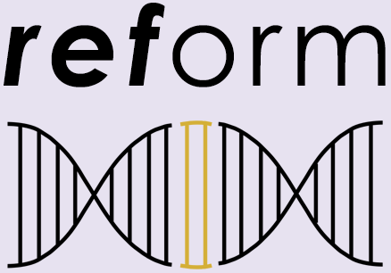

# *ref*ormWeb
A [*ref*orm](https://github.com/gencorefacility/reform) web UI implemented by [Flask](https://flask.palletsprojects.com/en/1.1.x/)

<p align="center">
  
</p>

## Configure Environment

```bash
python3 -m venv /path/to/venv
source /path/to/venv/bin/activate
pip install -r requirements.txt
```

## Start the Application
```bash
python app.py
```
Open URL: `localhost:5000`

## Using the Site

<p align="center">

</p>

- Fill the form with the required parameters
  * `email` Email address to have notifications sent to
  * `chrom` ID of the chromsome to modify
  * `position` Position in chromosome at which to insert <in_fasta>. Can use -1 to add to end of chromosome. Note: Either position, or upstream AND downstream sequence must be provided.
  * `upstream_fasta` Path to Fasta file with upstream sequence. Note: Either position, or upstream AND downstream sequence must be provided.
  * `downstream_fasta` Path to Fasta file with downstream sequence. Note: Either position, or upstream AND downstream sequence must be provided.
  * `in_fasta` Path to new sequence to be inserted into reference genome in FASTA format.
  * `in_gff` Path to GFF file describing new fasta sequence to be inserted.
  * `ref_fasta` Path to reference fasta file.
  * `ref_gff` Path to reference gff file.
- After submission, the data and files will be gathered and submitted to a message queue to run [*ref*orm](https://github.com/gencorefacility/reform)
- If sucessful or failure, an e-mail will be sent to the e-mail address provided

